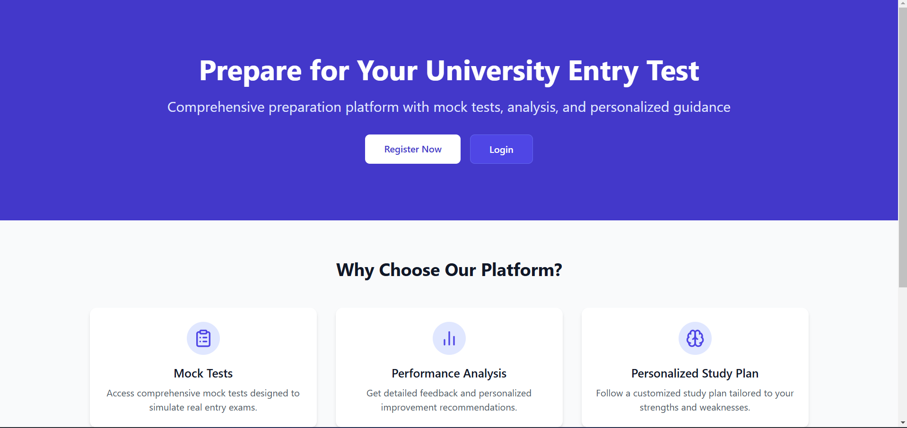
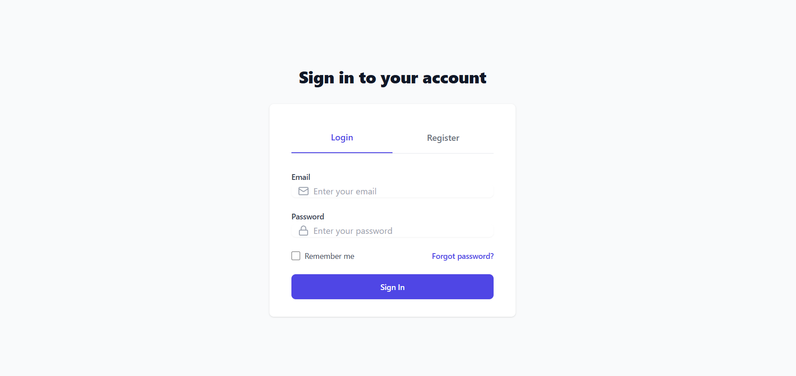
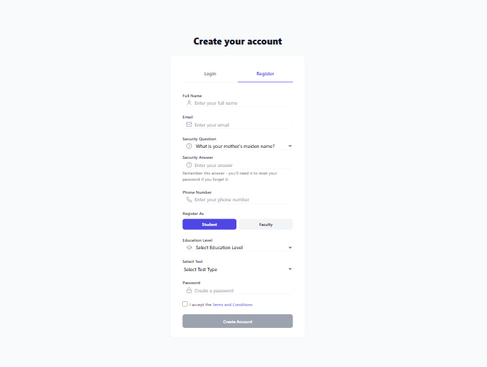
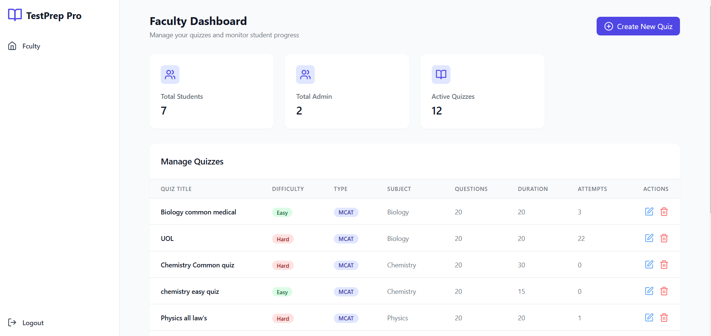

## University Entry Test Preparation Portal

The **University Entry Test Preparation Portal** is a web-based platform designed to help students prepare for university entry tests. It provides quizzes, information about universities test's, and department-specific test materials, making test preparation more accessible and efficient.

## Tech Stack

- **Frontend:** React (Vite)  
- **Backend:** Node.js (Express)  
- **Database:** MongoDB  

## Features

- User registration and authentication  
- Quiz system for entry test preparation  
- University and department details  
- Faculty user management for adding quizzes  

## Installation & Setup  

### Prerequisites  
Ensure you have **Node.js** and **MongoDB** installed on your system.  

### Clone the Repository  

```bash
git clone https://github.com/azeemkhannn/University_entery_test_preparing_fullstack_web.git
cd University_entery_test_preparing_fullstack_web
```

### Install Dependencies  

```bash
npm install
```

### Run the Application  

To start the frontend and backend:  

```bash
npm run dev
```

### Setup MongoDB  

1. Create a database in MongoDB named **testprep**.  
2. Ensure MongoDB is running locally or configure your **.env** file for a cloud-based connection.  

### Running the Server  

Navigate to the `server` folder:  

```bash
cd server
```

Start the backend server using **nodemon**:  

```bash
nodemon
```

## Folder Structure  

```
/university-entry-test-prep
├── /server  (Backend code)
│   ├── index.js  (Main server file)
│   ├── models/  (Database models)
│   ├── routes/  (API routes)
│   ├── controllers/  (Request handlers)
│   ├── config/  (Database configuration)
│   ├── .env  (Environment variables)
│   ├── package.json  
│   ├── ...
│
│ ├── src/
│ ├── public/
│ ├── package.json  
│ ├── ...
│
├── README.md  (Project documentation)
├── .gitignore  
```

## Screenshots

Some previews of the application displayed:

<p align="center">
  
  
  
</p>

<p align="center">
  
  
  
</p>

<p align="center">
  
  
  
</p>


## Contributing  

Feel free to fork the repository, open issues, and submit pull requests!  

## License  

This project is open-source under the MIT License.  
